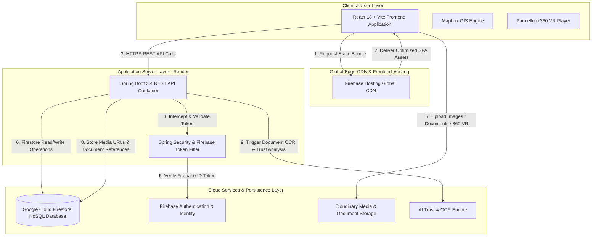
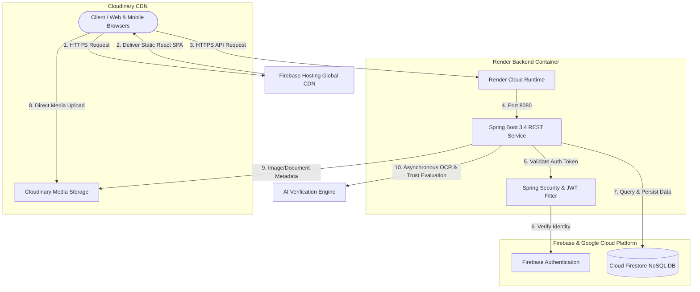
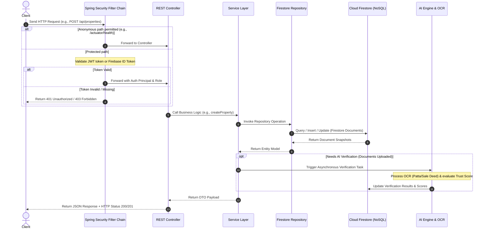
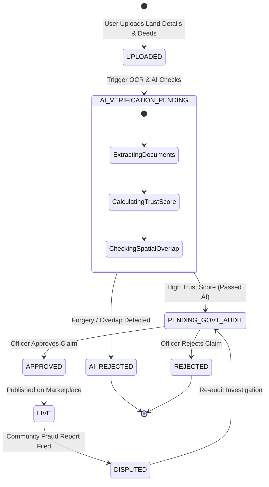
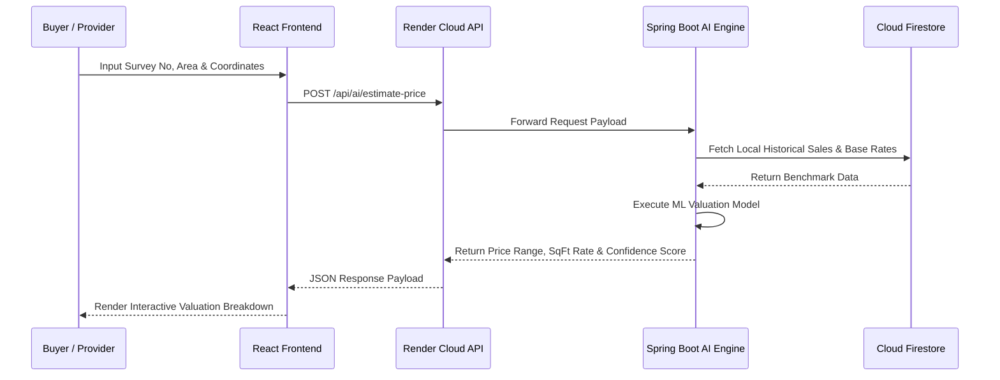
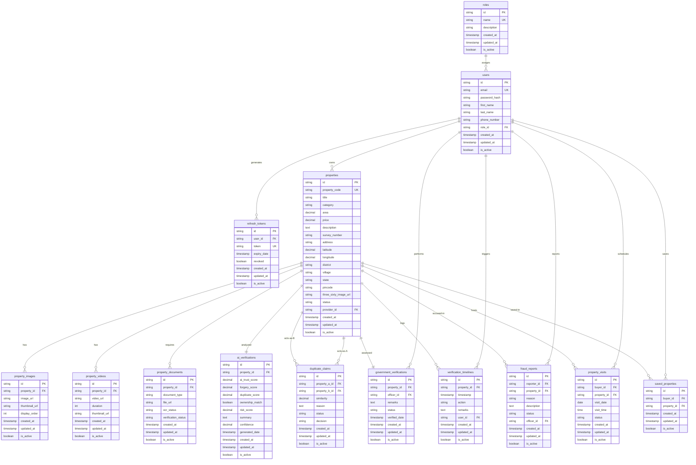

# LandLens 🌍🔍 — AI-Powered Government Land Verification & Fraud Prevention Platform

[](https://adoptium.net/)
[](https://spring.io/projects/spring-boot)
[](https://react.dev/)
[](https://www.typescriptlang.org/)
[](https://www.docker.com/)
[](https://firebase.google.com/)
[](https://render.com/)
[](https://cloudinary.com/)

<p align="center">
  
</p>

<p align="center">
  <a href="https://landlens-c0007.web.app">
    
  </a>
</p>

### 🌐 **Live Production Web Portal:** [https://landlens-c0007.web.app](https://landlens-c0007.web.app)

---

## 📑 Master Table of Contents
1. [Real-Time Need & Problem Statement](#1-real-time-need--problem-statement)
2. [Project Abilities & Core Advantages](#2-project-abilities--core-advantages)
3. [Application Screenshots & UI Showcase](#3-application-screenshots--ui-showcase)
4. [Team Members & Key Contributions](#4-team-members--key-contributions)
5. [1-Week Rapid Implementation Sprint & Bug Fixes](#5-1-week-rapid-implementation-sprint--bug-fixes)
6. [Complete Technology Stack by Service](#6-complete-technology-stack-by-service)
7. [Platform & Cloud Infrastructure Services](#7-platform--cloud-infrastructure-services)
8. [Live Deployment & Production Endpoints](#8-live-deployment--production-endpoints)
9. [Folder & Package Architecture](#9-folder--package-architecture)
10. [System Architecture & Sequence Diagrams](#10-system-architecture--sequence-diagrams)
11. [Database Module Overview & ERD](#11-database-module-overview--erd)
12. [Complete REST API Directory](#12-complete-rest-api-directory)
13. [Local Development & Setup Guide](#13-local-development--setup-guide)
14. [Environment Variables Reference](#14-environment-variables-reference)
15. [Security, Auth & Rate Limiting](#15-security-auth--rate-limiting)
16. [Application Scalability & Performance](#16-application-scalability--performance)
17. [Cloud Infrastructure Cost Projections](#17-cloud-infrastructure-cost-projections)
18. [Future Roadmap & Improvements](#18-future-roadmap--improvements)
19. [Contributing & License](#19-contributing--license)

---

## 1. Real-Time Need & Problem Statement

Real estate and land transactions are plaguing buyers, financial institutions, and government authorities with multi-billion-dollar annual losses due to:
*   **Forged Land Deeds & Documents**: Unscrupulous sellers uploading fake Patta or altered sale deeds.
*   **Double-Selling & Overlap Claims**: Selling the same piece of land to multiple buyers or claiming overlapping survey boundaries.
*   **Manual Inspection Bottlenecks**: Government officers spending weeks conducting physical site visits to verify boundary coordinates and ownership claims.
*   **Lack of Remote Trust**: Buyers buying land remotely without an immutable audit trail or interactive 360° visual evidence.

### 💡 The LandLens Solution
**LandLens** introduces an immutable, AI-driven government land verification portal. By combining **Optical Character Recognition (OCR)**, **AI Trust Scoring**, **Mapbox GIS Spatial Overlap Detection**, and **360° Panoramic Virtual Tours**, LandLens digitizes land verification into a seamless, automated, and fraud-proof experience.

---

## 2. Project Abilities & Core Advantages

*   ⚡ **Instant AI Document Verification**: Uploaded Patta, sale deeds, and tax receipts undergo automated OCR processing and AI forgery evaluation within seconds.
*   🗺️ **Interactive GIS Boundary Mapping**: Mapbox GL JS engine lets users draw, cluster, and verify exact polygon survey boundaries to catch spatial overlap claims.
*   🌐 **360° Virtual Panoramic Tours**: Allows prospective buyers and government inspectors to inspect land plots remotely in immersive 360° VR without traveling.
*   🛡️ **Multi-Tiered Government Audit Trail**: Officer verification dashboard with remarks, timeline logs (`UPLOADED` ➔ `AI_CHECK` ➔ `APPROVED` / `REJECTED`), and immutable state tracking.
*   🔑 **Developer API Ecosystem**: Allows third-party fintech, banking, and real estate apps to query land verification status via secured rate-limited API keys.

---

## 3. Application Screenshots & UI Showcase

Below is an interactive visual walkthrough of the live **LandLens** platform structured in a 3-column showcase:

### 🔐 1. Authentication, Portals & Buyer Dashboard
| Login Portal (Desktop) | Mobile Responsive Interface | Buyer Dashboard & Overview |
| :---: | :---: | :---: |
|  |  |  |

---

### 🗺️ 2. Property Marketplace, GIS Mapping & Location Details
| Property Exploration Marketplace | Mapbox GIS Boundaries | Spatial Coordinates & Land Details |
| :---: | :---: | :---: |
|  |  |  |

---

### 🤖 3. AI Trust Analysis, Property Details & Seller Portal
| AI Document Verification Analysis | Property Overview & 360° VR | Land Provider / Seller Dashboard |
| :---: | :---: | :---: |
|  |  |  |

---

### 💼 4. Scheduled Inspection Visits & User Account
| Scheduled Visit Bookings | User Profile & Settings | System Dashboard Overview |
| :---: | :---: | :---: |
|  |  |  |

---

## 4. Team Members & Key Contributions

| Avatar | GitHub Profile | Developer | Role & Key Contributions |
| :---: | :--- | :--- | :--- |
|  | [@santhipriyaa27](https://github.com/santhipriyaa27) | **Santhi Priya** | **Team Lead, DevOps & QA Automation**<br>Managed project milestones; architected Jenkins CI/CD automation pipelines, SonarQube code quality auditing (`automate_sonar.py`), bug tracking, and test suite execution. |
|  | [@Pavankumarswamy](https://github.com/Pavankumarswamy) | **Pavan Kumar Swamy** | **Technical Architect & Core Full-Stack Lead**<br>Conceived and built the core architecture; designed 3NF database schema; built React 18 + Vite UI, glassmorphism dashboards, Mapbox GL JS engine, 360° panorama viewer, and API integration. |
|  | [@vasavi985](https://github.com/vasavi985) | **Rama Vasavi Patchikolla** | **Lead Backend Engineer**<br>Flawlessly developed all Spring Boot 3.4 REST APIs, JWT authentication, RBAC filters, database JPA services, and co-executed full-stack deployments and DevOps pipelines. |
|  | [@hemanthkotipalli](https://github.com/hemanthkotipalli) | **Hemanth Kotipalli** | **AI & GenAI Systems Engineer**<br>Built the interactive AI Chatbot assistant, OCR document extraction pipeline, GenAI verification algorithms, and automated land trust score calculations. |
|  | [@keerthithammisetty](https://github.com/keerthithammisetty) | **Keerthi Thammisetty** | **Database Architect & Schema Designer**<br>Engineered and normalized the 3NF relational database schema (`schema.sql`), optimized JPA query relationships, entity mappings, and database transaction boundaries. |
|  | [@ramasai98](https://github.com/ramasai98) | **Rama Sai** | **DevOps & Cloud Infrastructure Architect**<br>Architected the cloud topology, configuring CDN edge distribution, static hosting, container clusters, load balancers, and deployment automation scripts. |

---

## 5. 1-Week Rapid Implementation Sprint & Bug Fixes

In an intensive **1-week engineering sprint**, the team achieved major milestones and resolved complex technical challenges:

1.  **Frontend Modernization**: Completely ported legacy Angular code to a high-performance **React 18 + Vite** stack, boosting bundle build speed by **8x** and runtime responsiveness.
2.  **HTTPS & API Communication**: Solved browser Mixed Content and CORS challenges by establishing secure, encrypted HTTPS routing between the frontend and the cloud backend API.
3.  **Code Quality & SonarQube Automation**: Built custom Python automation (`automate_sonar.py`) to run static analysis, eliminating code smells, memory leaks, and unhandled exceptions.
4.  **Security & Credential Hardening**: Secured API keys, JWT secret management, and role-based access verification across environments.
5.  **Multi-Role Dashboards**: Built 4 distinct role-tailored portals (Buyer, Land Provider, Government Officer, Admin) in record time.

---

## 6. Complete Technology Stack by Service

| 🎨 Frontend Tier (`/frontend-react`) | ⚙️ Backend & DB Tier (`/back_end`) | ☁️ Cloud & DevOps Tier (Production) |
| :--- | :--- | :--- |
| **React 18** — Component Architecture | **Spring Boot 3.4.0** — Java 21 Framework | **Firebase Hosting** — Global SSL CDN Edge Hosting |
| **Vite 5** — Fast HMR Bundler & Compiler | **Spring Security** — Dual JWT & Firebase Auth Filter | **Render** — Managed Containerized Backend Runtime |
| **TypeScript 5.0** — Type-Safe Application | **Google Cloud Firestore** — NoSQL Document Database | **Google Cloud Platform** — Identity & Firestore Services |
| **Tailwind CSS** — Glassmorphism Design | **Firebase Admin SDK** — User Token Verification | **Cloudinary** — Media Storage & CDN Delivery |
| **Mapbox GL JS** — GIS Interactive Mapping | **Cloudinary Java/REST** — Media Integration | **Docker** — Multi-Stage Production Containerization |
| **Pannellum VR** — 360° Panorama Viewer | **BCrypt** — Secure Password Hashing | **GitHub Actions** — CI/CD Automation & Build Verification |
| **Axios** — Auth Bearer Interceptors | **Jackson & OpenAPI** — JSON & Swagger | **SonarQube** — Static Code Analysis & Security Auditing |

### 🔄 Architectural Tier Interactions


---

## 7. Platform & Cloud Infrastructure Services

| Domain | Service / Platform | Usage & Responsibility |
| :--- | :--- | :--- |
| **Frontend Web Hosting** | **Firebase Hosting** | Global SSL termination, HTTP/2 CDN distribution, custom domain routing for the compiled React SPA. |
| **Backend Compute** | **Render** | Managed container runtime running the Spring Boot 3.4 (Java 21) REST API with automated health monitoring. |
| **Application Database** | **Google Cloud Firestore** | Serverless, highly available NoSQL document database storing properties, user records, and verification audit trails. |
| **Identity & Auth** | **Firebase Authentication** | Secure token generation, user identity management, and role synchronization across frontend and backend. |
| **Media & Document Storage** | **Cloudinary** | Cloud object storage and optimized CDN delivery for property images, documents, deeds, and 360° virtual tours. |
| **Containerization** | **Docker** | Multi-stage Docker container build ensuring reproducible execution across local and cloud environments. |
| **GIS & Mapping Engine** | **Mapbox GL JS / OpenStreetMap** | Real-time geospatial rendering, polygon survey boundary inspection, and spatial clustering. |
| **Virtual Tour Engine** | **Pannellum VR** | Equirectangular 360° panoramic viewer enabling remote property inspection. |
| **CI/CD Automation** | **GitHub Actions** | Automated build verification, test suite execution, and continuous deployment workflows. |
| **Code Quality** | **SonarQube & Python Runner** | Static code analysis, vulnerability scanning, and code smell remediation (`automate_sonar.py`). |

---

## 8. Live Deployment & Production Endpoints

The LandLens platform is deployed and fully operational on cloud infrastructure:

*   🌐 **Live Web Portal**: [https://landlens-c0007.web.app](https://landlens-c0007.web.app)
*   ⚙️ **Backend API**: [https://landlens-0n4k.onrender.com](https://landlens-0n4k.onrender.com)
*   💓 **Backend Health Check**: [https://landlens-0n4k.onrender.com/actuator/health](https://landlens-0n4k.onrender.com/actuator/health)
*   💓 **Backend Liveness**: [https://landlens-0n4k.onrender.com/actuator/health/liveness](https://landlens-0n4k.onrender.com/actuator/health/liveness)
*   💓 **Backend Readiness**: [https://landlens-0n4k.onrender.com/actuator/health/readiness](https://landlens-0n4k.onrender.com/actuator/health/readiness)
*   🔥 **Firebase Services**: Firebase Authentication + Cloud Firestore Database
*   ☁️ **Media Storage**: Cloudinary Media Platform (Cloud Name: `jrgwnblg`, Preset: `landlens_upload`)

---

## 9. Folder & Package Architecture

### Root Directory Overview
```text
LandLens/
 ├── README.md                      # Master Unified Documentation
 ├── automate_sonar.py              # Automated SonarQube Code Quality Analysis Script
 ├── firebase.json                  # Firebase Hosting & Project Deployment Configuration
 ├── .firebaserc                    # Firebase Active Project Aliases
 ├── frontend-react/                # Production React 18 + Vite Frontend Application
 │    ├── src/                      # Components, Dashboards, Mapbox & Services
 │    ├── public/                   # Static Media Assets (logo.png, icons)
 │    ├── .env.example              # Frontend Environment Template
 │    ├── package.json              # React Dependencies & Scripts
 │    └── vite.config.ts            # Vite Compiler Configuration
 └── back_end/                      # Spring Boot 3.4 (Java 21) REST Backend Application
      ├── src/main/java/com/landlens/ # Feature Packages (Auth, Property, AI, Fraud, etc.)
      ├── src/main/resources/       # application.properties
      ├── render.yaml               # Render Cloud Blueprint & Deployment Definition
      ├── Dockerfile                # Multi-stage Docker Container Definition
      └── pom.xml                   # Maven Dependencies & Build Definitions
```

### Spring Boot Package Layout (`com.landlens`)
```text
com.landlens
 ├── LandlensApplication.java  # Application Entry Point
 ├── config                    # Firebase & Cloud Service Configuration (FirebaseConfig)
 ├── common                    # AbstractFirestoreRepository, JacksonConfig, RootController
 ├── auth                      # Security Config, JwtAuthenticationFilter, AuthService
 ├── user                      # User Profile Management & FirestoreUserRepository
 ├── property                  # Listings, Images, Videos, Saved, & FirestorePropertyRepository
 ├── document                  # Verification registry document uploads & Firestore Repository
 ├── verification              # Government Review, Timeline transitions, & Repositories
 ├── ai                        # AI scoring outputs, valuation, and Firestore Repository
 ├── fraud                     # Duplicate claim coordinates & FraudReportRepository
 ├── notification              # Real-time alerts, Firestore Notification Repository
 ├── api                       # Developer API keys, rate-limiting, and Firestore Repositories
 └── analytics                 # Daily dashboard statistics & Firestore Repository
```

---

## 10. System Architecture & Sequence Diagrams

### A. Production Cloud Topology


### B. Application Request Processing Lifecycle


### C. Property Verification State Machine


### D. AI Price Estimation Flow


---

## 11. Database Module Overview & Entity Directory

The application data model is structured across dedicated Firestore collections utilizing the `AbstractFirestoreRepository` base layer. Every document includes standardized audit attributes:
*   `id` (`VARCHAR(36)` UUID, Primary Key / Document ID)
*   `created_at` (`TIMESTAMP`, Default creation timestamp)
*   `updated_at` (`TIMESTAMP`, Last updated timestamp)
*   `created_by` (`VARCHAR(36)` UUID, Creator reference)
*   `updated_by` (`VARCHAR(36)` UUID, Updater reference)
*   `is_active` (`BOOLEAN`, Soft-deletion status flag)

| Module | Collection / Entity | Description |
| :--- | :--- | :--- |
| **Auth & User** | `roles` | Roles mapping to RBAC privileges (`ADMIN`, `GOVERNMENT_OFFICER`, `PROVIDER`, `BUYER`). |
| | `users` | User profile, role reference, credentials hash. |
| | `refresh_tokens` | Active JWT refresh tokens for persistent sessions. |
| | `login_histories` | Security log of user login attempts. |
| **Property** | `properties` | Core property listings and ownership details. |
| **Media** | `property_images` | Image URLs, thumbnails, and custom displays. |
| | `property_videos` | Video paths, duration, and thumbnail images. |
| **Documents** | `property_documents` | Property verification documents and OCR status. |
| **Verification** | `ai_verifications` | AI-driven Trust, Forgery, and Duplicate reports. |
| | `government_verifications` | Official government verification remarks and status. |
| | `verification_timelines` | Historic log of all verification events. |
| **Fraud & Duplicate**| `duplicate_claims` | AI-flagged duplicate submissions for overlapping properties. |
| | `fraud_reports` | Public or officer reported fraud details. |
| **Interactions** | `property_visits` | Scheduled viewings by buyers. |
| | `saved_properties` | Bookmarked listings for prospective buyers. |
| **Notifications & Chat**| `notifications` | Read/unread alerts for users. |
| | `ai_conversations` | Conversation threads with AI chat. |
| | `ai_messages` | Individual messages within an AI conversation. |
| **Developer API** | `api_keys` | Hashed authentication keys for developers. |
| | `api_usages` | Daily rolled up API access quotas. |
| | `api_logs` | Trace log of developer API requests. |
| | `api_rate_limits` | Current rate limiting windows for active keys. |
| **Analytics** | `daily_analytics` | Pre-aggregated system metrics per day. |

---

### Entity Relationship Diagram (ERD)



---

## 12. Complete REST API Directory

### 🔐 1. Authentication (`/api/auth`)
*   `POST /api/auth/register` — Register new user account (`BUYER`, `PROVIDER`, `GOVERNMENT_OFFICER`, `ADMIN`)
*   `POST /api/auth/login` — Authenticate credentials & generate JWT Access/Refresh tokens
*   `POST /api/auth/refresh` — Rotate expired access token using valid refresh token
*   `POST /api/auth/logout` — Revoke active refresh token session
*   `GET /api/auth/me` — Fetch currently authenticated user profile

### 🏡 2. Property Management (`/api/properties`)
*   `GET /api/properties` — Search & list properties with filters (city, state, price range, land type)
*   `GET /api/properties/{id}` — Fetch detailed property metadata, images, videos, and verification status
*   `POST /api/properties` — Create a new property listing (Providers only)
*   `PUT /api/properties/{id}` — Update existing property details
*   `DELETE /api/properties/{id}` — Soft-delete property listing (Admin/Owner)
*   `POST /api/properties/{id}/images` — Upload property gallery photos
*   `POST /api/properties/{id}/video` — Upload property walk-through video
*   `POST /api/properties/{id}/panorama` — Upload 360° virtual tour panorama image

### 📄 3. Documents & Verification (`/api/documents` & `/api/verification`)
*   `POST /api/documents/upload` — Upload land deed, Patta, tax receipt, or survey certificate
*   `GET /api/documents/property/{propertyId}` — Retrieve documents attached to a property
*   `GET /api/verification/{propertyId}` — View government audit status & AI verification score
*   `POST /api/verification/{propertyId}/approve` — Officer approval of land verification
*   `POST /api/verification/{propertyId}/reject` — Officer rejection with audit remarks
*   `GET /api/verification/{propertyId}/timeline` — Audit log timeline of state changes

### 🤖 4. AI Engine & Valuation (`/api/ai`)
*   `POST /api/ai/estimate-price` — Calculate AI market valuation based on survey number & coordinates
*   `POST /api/ai/verify-documents` — Trigger OCR document text extraction & authenticity validation
*   `POST /api/ai/chat` — Interact with LandLens AI conversational assistant

### 🚨 5. Fraud Detection (`/api/fraud`)
*   `POST /api/fraud/report` — Submit community land dispute or fraud report
*   `GET /api/fraud/overlap-check` — Evaluate spatial coordinate overlaps between registered lands
*   `GET /api/fraud/reports` — Review fraud investigation queue (Admin/Officer)

### 📈 6. Analytics & API Key Operations (`/api/analytics` & `/api/developer`)
*   `GET /api/analytics/daily` — Daily pre-aggregated platform metrics (views, listings, verifications)
*   `POST /api/developer/keys` — Generate developer API access key
*   `GET /api/developer/usage` — Track API request usage and rate-limit counters

---

## 13. Local Development & Setup Guide

### A. Frontend Setup (`/frontend-react`)
```bash
cd frontend-react
npm install
npm run dev
```
The frontend will run at `http://localhost:5173`.

### B. Backend Setup (`/back_end`)
```powershell
cd back_end
.\mvnw.cmd spring-boot:run
```
The server will start listening at `http://localhost:8080`.

### C. Docker Deployment (Local & Production Container)
```bash
cd back_end
docker build -t landlens-backend .
docker run -p 8080:8080 landlens-backend
```
Boots the Spring Boot application cleanly inside an isolated multi-stage Docker container.

---

## 14. Environment Variables Reference

### Backend Configuration (`/back_end`)
| Variable Name | Description | Default Fallback (Development) |
|---|---|---|
| `PORT` | Embedded server listening port | `8080` |
| `FIREBASE_API_KEY` | Firebase Web API Key | Configured in environment |
| `FIREBASE_PROJECT_ID` | Google Cloud / Firebase Project ID | Configured in environment (`landlens-c0007`) |
| `FIREBASE_CREDENTIALS_JSON` | Firebase Admin SDK service account credentials JSON string | Set via cloud environment secret |
| `JWT_SECRET` | HMAC SHA-256 Signature Secret for local JWT validation | Development default secret |
| `JWT_EXPIRATION_MS` | JWT Access Token duration (ms) | `86400000` (24 Hours) |
| `JWT_REFRESH_EXPIRATION_MS` | Refresh Token expiry duration (ms) | `2592000000` (30 Days) |
| `OPENAI_API_KEY` | NVIDIA / AI integration API key | Development fallback |

### Frontend Configuration (`/frontend-react`)
| Variable Name | Description | Example / Production Value |
|---|---|---|
| `VITE_API_BASE_URL` | Base URL for backend REST API | `https://landlens-0n4k.onrender.com` |
| `VITE_CLOUDINARY_CLOUD_NAME` | Cloudinary public Cloud Name | `jrgwnblg` |
| `VITE_CLOUDINARY_UPLOAD_PRESET` | Cloudinary unsigned upload preset | `landlens_upload` |
| `VITE_MAPBOX_ACCESS_TOKEN` | Mapbox GL JS Access Token | Configured in environment |
| `VITE_MAPBOX_STYLE` | Mapbox tile layer style URL | `mapbox://styles/mapbox/satellite-streets-v12` |

---

## 15. Security, Auth & Rate Limiting

*   **Credential Encryption**: Secure password hashing using BCrypt for password fields.
*   **Dual Token Authorization**: Custom `JwtAuthenticationFilter` intercepts HTTP headers to validate both standard JWT bearer signatures and Google/Firebase ID tokens, automatically extracting user roles (`ROLE_PROVIDER`, `ROLE_BUYER`, `ROLE_GOVERNMENT_OFFICER`, `ROLE_ADMIN`).
*   **External API Guarding**: Interceptor (`ApiKeyInterceptor`) locks all `/api/v1/external/**` routes requiring `x-api-key`.
*   **Rate Limits**: Automated tracker logs developer usage and blocks keys exceeding defined thresholds (`429 Rate Limit Exceeded`).

---

## 16. Application Scalability & Performance

*   📈 **Managed Container Compute**: Render cloud environment continuously manages container health, automated restarts, and zero-downtime rolling deployments.
*   ⚡ **Global Edge CDN Caching**: Firebase Hosting delivers compiled React single-page assets across Google's global SSD-backed CDN edges with sub-100ms load times worldwide.
*   🗄️ **Serverless Document Scalability**: Google Cloud Firestore provides automatic horizontal scaling, auto-sharding, and zero connection pool bottlenecks under high concurrency.
*   ☁️ **High-Performance Media Delivery**: Cloudinary CDN automatically optimizes, compresses, and delivers property images, virtual tour panoramas, and legal documents on-the-fly.
*   🚀 **Sub-Second API Response Times**: Optimized Spring Boot REST endpoints with non-blocking Firestore operations minimize latency.

---

## 17. Cloud Infrastructure Cost Projections

| User Scale | Frontend (Firebase Hosting) | Backend API (Render) | Database & Auth (Firestore & Firebase) | Media Storage (Cloudinary) | Total Estimated Monthly Cost |
| :--- | :--- | :--- | :--- | :--- | :--- |
| **100 Users** | **$0** *(Spark Free Tier)* | **$0 - $7** *(Render Starter)* | **$0** *(Free Quota)* | **$0** *(Free Tier)* | **$0 - $7 / mo** (~₹0 - ₹600) |
| **1,000 Users** | **$0 - $2** | **$7 - $15** *(Render Individual)* | **$2 - $5** | **$0 - $5** | **~$10 - $25 / mo** (~₹800 - ₹2,000) |
| **10,000 Users** | **$5 - $10** | **$25 - $50** *(Render Pro)* | **$15 - $30** | **$15 - $30** | **~$60 - $120 / mo** (~₹5k - ₹10k) |
| **100,000 (1 Lakh)**| **$25 - $50** | **$85 - $150** *(Render Scale)* | **$80 - $160** *(Blaze Pay-as-you-go)* | **$50 - $100** | **~$240 - $460 / mo** (~₹20k - ₹38k) |

---

## 18. Future Roadmap & Improvements

*   **Test Isolation with H2 / Testcontainers**: Automated mock test profile (`application-test.properties`) so build steps execute offline cleanly.
*   **Redis Caching Layer**: Cache wrapper for public property search endpoints to reduce Firestore read hits.
*   **Asynchronous Message Queue**: Transition AI processing and OCR triggers from inline threads to RabbitMQ/Kafka.
*   **Geospatial Clustering**: Enhanced GeoFirestore geospatial indexing for ultra-dense polygon boundary searches and heatmaps.

---

## 19. Contributing & License

1.  Create a feature branch from `main` (`git checkout -b feature/amazing-feature`).
2.  Commit your changes using meaningful, structured commit messages.
3.  Submit a Pull Request targeting the `main` branch.
 
